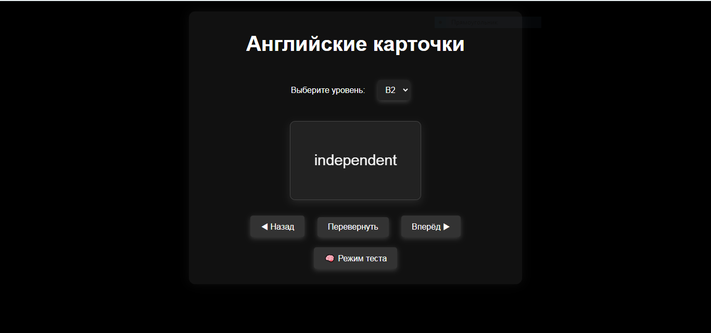

# Английские Карточки 🌟
Здраствуйте меня зовут Бейбарыс и я создатель этого сайта.
Мой [Github](https://github.com/BIKO222).
Проект для изучения английских слов с помощью интерактивных карточек. Поддерживаются уровни от **A1** до **C2**, а также красивые анимации и стили для улучшения пользовательского опыта.
## Обо мне:
- 👋 Привет, я @BIKO222
- 👀 Интересуюсь Frontend, Backend и ИИ-инжинирингом
- 🌱 Сейчас изучаю искусственный интеллект
- 📫 Связаться со мной: email — bikodoo2010@gmail.com, номер — 8 778 446 9243
- 😄 Местоимения: Он
- ⚡ Факт обо мне: Мне 14 лет, живу в селе

<!---
BIKO222/BIKO222 — это ✨ особенный ✨ репозиторий, потому что его `README.md` отображается на твоем GitHub-профиле.
Нажми на ссылку "Preview", чтобы посмотреть изменения.
-->

## 📝 Функционал
- **Выбор уровня**: A1–C2.
- **Переворот карточек**: Нажмите кнопку, чтобы увидеть перевод.
- **Навигация**: Возможность листать карточки вперёд и назад.
- **Красивый дизайн**: Космический фон, стилизованные кнопки и плавные анимации.
  
## 🖼️ Снимки экрана
Пример главного экрана:

## 🛠️ Технологии:
- HTML
- CSS
- JavaScript

## 🎯 Цели проекта
### Этот проект предназначен для:
- Помощи учащимся в изучении английского языка.
- Обеспечения удобного интерфейса для тренировок словарного запаса.
